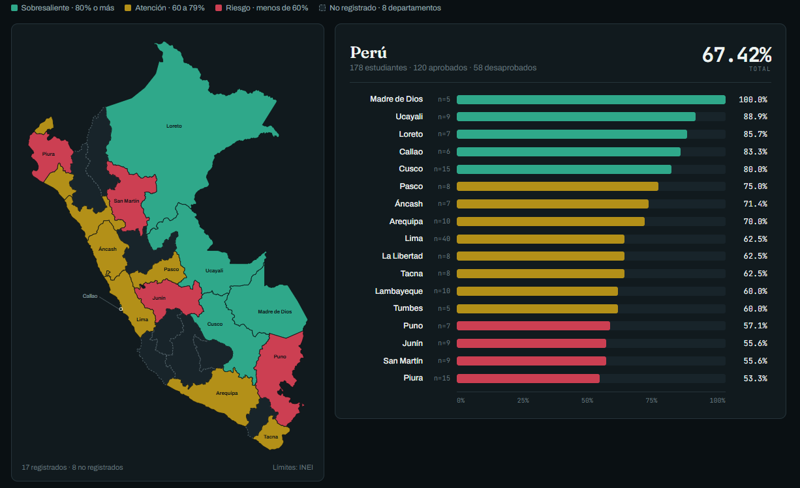

# Análisis Exploratorio de Datos: Rendimiento Académico Estudiantil


Análisis exploratorio de datos (EDA) sobre el rendimiento académico de **200 estudiantes** distribuidos en **25 departamentos del Perú**, desarrollado con Python, Pandas y NumPy. El proyecto cubre desde la limpieza de datos hasta estadística descriptiva, segmentación, detección de outliers y generación de un reporte final consolidado.

---

## Tabla de contenidos

- [Descripción](#descripción)
- [Dataset](#dataset)
- [Estructura del proyecto](#estructura-del-proyecto)
- [Metodología](#metodología-del-análisis)
- [Resultados destacados](#resultados-destacados)
- [Tecnologías](#tecnologías-utilizadas)
- [Cómo ejecutarlo](#cómo-ejecutarlo)
- [Autor](#autor)

---

## Descripción

Este proyecto responde a la pregunta: **¿cómo varía el rendimiento académico de los estudiantes según su edad y departamento de procedencia?**

A partir de un dataset con notas, edades y departamentos, se realiza un pipeline completo de análisis de datos:

1. Carga y exploración inicial del dataset.
2. Detección y tratamiento de valores faltantes.
3. Cálculo de estadística descriptiva (media, mediana, desviación estándar, cuartiles).
4. Identificación de outliers mediante z-score.
5. Segmentación por grupo etario y departamento.
6. Cálculo de tasas de aprobación y escalas de calificación (AD, A, B, C).
7. Exportación de un reporte consolidado en CSV y Excel.

## Dataset

| Archivo | Descripción |
|---|---|
| `estudiantes.csv` | Dataset original: 200 registros con `Nombre`, `Edad`, `Nota` y `Departamento`. Contiene valores faltantes en `Edad` y `Nota`. |
| `reporte.csv` | Reporte agregado por departamento (estudiantes, promedio, mediana, desviación estándar, tasa de aprobación). |
| `reporte_final.xlsx` | Versión en Excel del reporte final, filtrado a departamentos con 5+ estudiantes. |

**Columnas del dataset original:**

| Columna | Tipo | Descripción |
|---|---|---|
| `Nombre` | texto | Nombre del estudiante |
| `Edad` | numérico | Edad del estudiante (contiene nulos) |
| `Nota` | numérico | Nota final, escala 0-20 (contiene nulos) |
| `Departamento` | categórico | Departamento del Perú al que pertenece |

## Estructura del proyecto

```
Proyectos-data/
├── analisis.ipynb                       # Notebook con el desarrollo completo del análisis
├── analisis_data.py                     # Script equivalente en Python puro
├── estudiantes.csv                      # Dataset original
├── reporte.csv                          # Reporte agregado por departamento
├── reporte_final.xlsx                   # Reporte final en Excel
├── proyecto_analisis_estudiantes_v2.pdf # Informe/documento del proyecto
└── README.md
```

## Metodología del análisis

<details>
<summary><strong>1. Exploración y calidad de datos</strong></summary>

Se inspeccionó la forma, los tipos de datos y la estructura general del dataset (`shape`, `dtypes`, `info()`), y se contaron los valores únicos de `Departamento` (25 en total). Sobre esa base se midió cuántos valores faltaban en `Edad` y en `Nota`, en cantidad y en porcentaje.
</details>

<details>
<summary><strong>2. Limpieza de datos</strong></summary>

Los registros sin `Nota` se eliminaron, por ser la variable objetivo del análisis. La `Edad` faltante se imputó con la mediana del grupo.
</details>

<details>
<summary><strong>3. Estadística descriptiva</strong></summary>

- Media, mediana, desviación estándar y varianza de `Nota` y `Edad`, junto con mínimo, máximo, rango y cuartiles (Q1, Q2, Q3).
- Identificación de los estudiantes con la nota más alta y la más baja.
</details>

<details>
<summary><strong>4. Análisis de aprobación</strong></summary>

Cada estudiante se clasificó como `Aprobado` (Sí/No) según si su nota alcanzaba 11 o más, y a partir de eso se calculó la tasa de aprobación general y por departamento. También se definió una escala en cuatro niveles: AD (18 o más), A (14 o más), B (11 o más) y C (menos de 11).
</details>

<details>
<summary><strong>5. Segmentación y cruces</strong></summary>

- Agrupación por rango etario: `16-19`, `20-22`, `23-25`, `26+`.
- Tablas cruzadas (`crosstab`) de aprobación por departamento y por grupo etario, y promedio de notas por departamento ordenado de mayor a menor.
</details>

<details>
<summary><strong>6. Normalización y outliers</strong></summary>

Las notas se normalizaron con Min-Max y se estandarizaron con z-score. Los valores con |z| mayor a 2 se marcaron como atípicos.
</details>

<details>
<summary><strong>7. Reporte final</strong></summary>

- Consolidado por departamento: cantidad de estudiantes, promedio, mediana, desviación estándar, mínimo, máximo, aprobados, desaprobados y tasa de aprobación.
- Se descartan los departamentos con menos de 5 estudiantes, para no promediar sobre grupos poco representativos.
- El resultado se exporta a `reporte.csv` y `reporte_final.xlsx`.
</details>

## Resultados destacados

Top 5 departamentos por tasa de aprobación (mínimo 5 estudiantes):

| Departamento | Estudiantes | Nota promedio | Tasa de aprobación |
|---|---|---|---|
| Madre de Dios | 5 | 14.92 | **100 %** |
| Ucayali | 9 | 14.97 | **88.9 %** |
| Loreto | 7 | 12.10 | **85.7 %** |
| Callao | 6 | 13.78 | 83.3 % |
| Cusco | 15 | 13.55 | 80.0 % |

Reporte completo y ordenado disponible en [`reporte.csv`](./reporte.csv) y [`reporte_final.xlsx`](./reporte_final.xlsx).

## Tecnologías utilizadas

- **Python 3**
- **Pandas**: limpieza, agregación y análisis tabular
- **NumPy**: cálculos estadísticos y vectorizados
- **Jupyter Notebook**: desarrollo interactivo del análisis
- **Excel / CSV**: exportación de resultados

## Cómo ejecutarlo

```bash
# Clonar el repositorio
git clone https://github.com/Alexander19l/Proyectos-data.git
cd Proyectos-data

# Instalar dependencias
pip install pandas numpy openpyxl jupyter

# Opción A: ejecutar el script
python analisis_data.py

# Opción B: explorar el notebook paso a paso
jupyter notebook analisis.ipynb
```

## Autor

Proyecto desarrollado como parte de una práctica de análisis de datos con Python.

**Repositorio:** [Alexander19l/Proyectos-data](https://github.com/Alexander19l/Proyectos-data)

## Cuadro Representativo de los datos extraídos



Vista consolidada de los 25 departamentos: 178 estudiantes con nota registrada, 120 aprobados y 58 desaprobados (67.42% de tasa de aprobación total). El color indica el nivel de cada departamento: verde para 80% o más, ámbar entre 60% y 79%, y rojo por debajo de 60%.
